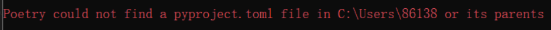

# 真寻安装遇见的报错/问题总结来源issues

问题还不全 等待更新
## 1.使用poetry install命令时报错 

#### 报错图：
<br>
    

#### 原因：

这个报错是你没有pyproject.toml这个文件导致的

#### 解决办法

方法一（无需操作自动创建）：进入你的项目文件夹，运行
```
poetry new myproject

```
方法二（需要另外操作）：进入你的项目文件夹，运行

```
poetry init

```
## 2.登录gocq时出现 登录失败: 登录失败

#### 报错内容
[2023-05-06 17:34:17] [WARNING]: 登录失败: 登录失败，建议升级最新版本后重试，或通过问题反馈与我们联系。 Code: 45

[2023-05-06 17:34:17] [WARNING]: 你的账号涉嫌违规被限制在非常用设备登录, 请在手机QQ登录并根据提示完成认证

[2023-05-06 17:34:17] [WARNING]: 或使用 -update-protocol 升级到最新协议后重试

#### 原因：

你不按照本教程安装来导致的

#### 解决办法
1.下载新版签名和支持的gocq

[点击此处查看教程](https://gitee.com/SHIKEAIXY/zhenxun#%E5%9B%9B-%E5%AE%89%E8%A3%85-go-cqhttp)

## 3.首次启动bot报错

报错内容 
ImportError: cannot import name 'connections' from 'tortoise' 

#### 原因：

tortoise-orm源码一看找不到Tortoise索引

#### 解决办法

进入真寻根目录，运行
```
pip install tortoise-orm -U

```

## 4.使用poetry install报错 

报错图：
<br>
    

#### 解决办法

根目录运行，可以看到所有需要安装的依赖 手动安装即可
```
poetry show

```

## 5.使用poetry install报错 

报错图：
<br>
    

### 原因：依赖文件写死了5.4.1但是这个版本已弃用导致安装不上

#### 解决办法

1.下载pyproject:toml此文件，链接：[https://share.weiyun.com/3lEAAKpr ](https://share.weiyun.com/3lEAAKpr )

2.覆盖原真寻的文件(防止你这个笨蛋改错了~)

3.根目录cmd运行
```
poetry lock
poetry install

```

# 更多问题请前往真寻github库提issues