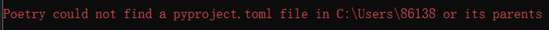

# 真寻安装遇见的报错/问题总结来源issues

## 使用poetry install命令时报错 

#### 报错图：
<br>
    

#### 原因：

这个报错是你没有pyproject.toml这个文件导致的

#### 解决办法

方法一：进入你的项目文件夹，运行
```
poetry init

```
方法二（替代方法）：进入你的项目文件夹，运行
```
poetry new myproject

```
