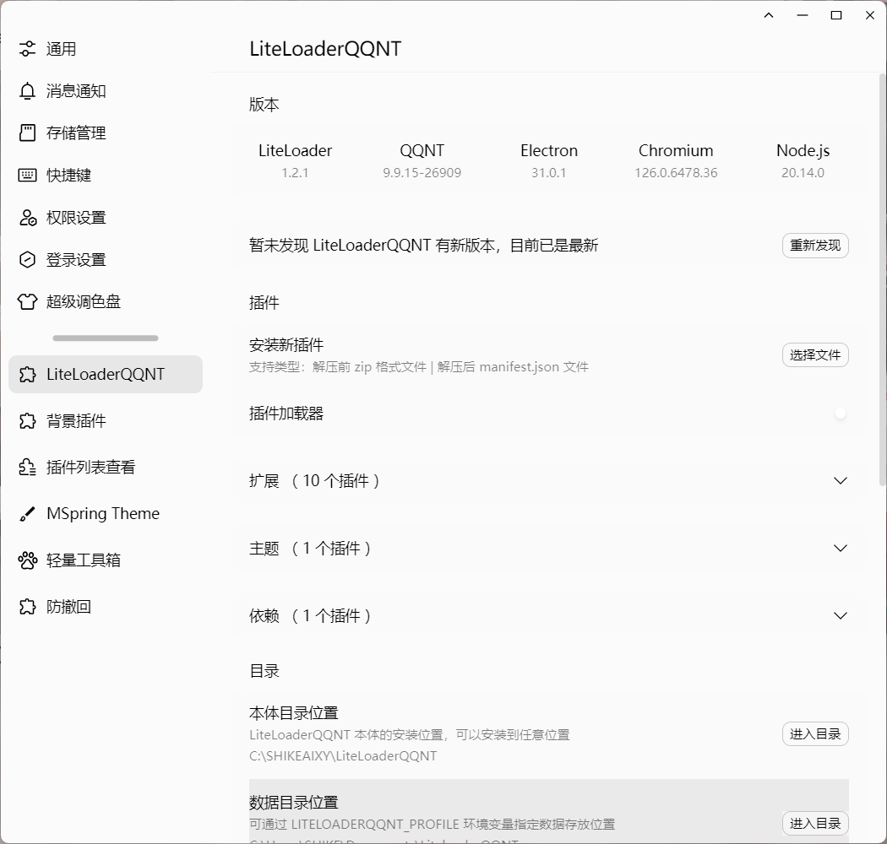

::: danger
本站该教程已经过作者允许上传

另外请勿将与本教程任何相关内容上传至流量平台如：B站
:::

# ①LLOneBot相关

1. LLOneBot 可以使你成为人机X（人机合一）

2. LLOneBot 是基于 PC NTQQ 本体实现一套无头 Bot 框架。

3. LLOneBot 可以使你的 NTQQ 支持 OneBot 11 协议进行 QQ 机器人开发的无需GUI界面的NTQQ

4. [LiteLoaderQQNT官方文档](https://llonebot.github.io/zh-CN)

5. 本教程以 LiteLoaderQQNT_Install V1.1.5 && LLOneBot v3.28.6 && NTQQ v9.9.15-26909 为例

## ②安装NTQQ

1. [点击此处前往QQ官网下载NTQQ](https://im.qq.com/pcqq/index.shtml)（目前可用最新版本QQ）

2. 安装NTQQ

## ③下载 LiteLoaderQQNT_Install 脚本

[点击此处前往releases下载最新脚本](https://github.com/Mzdyl/LiteLoaderQQNT_Install/releases)

1. 尽量下载新版 LiteLoaderQQNT_Install 在新版中可能解决了旧版存在在Bug
 - 点击 Assets 下载 install_windows.exe

## ④脚本安装LiteLoaderQQNT

1. 关闭正在运行的NTQQ

2. 管理员权限运行下载的 LiteLoaderQQNT_Install 脚本

3. 等待脚本执行完毕

## ⑤安装LLOneBot

1. 启动 NTQQ 并打开设置查看是否安装成功

2. 前往插件列表下翻找到 LLOneBot 进行安装

选择任意一个安装即可

3. 等待安装完成后重启 NTQQ 并打开设置查看是否安装成功

## [➊ 返回上级](./)