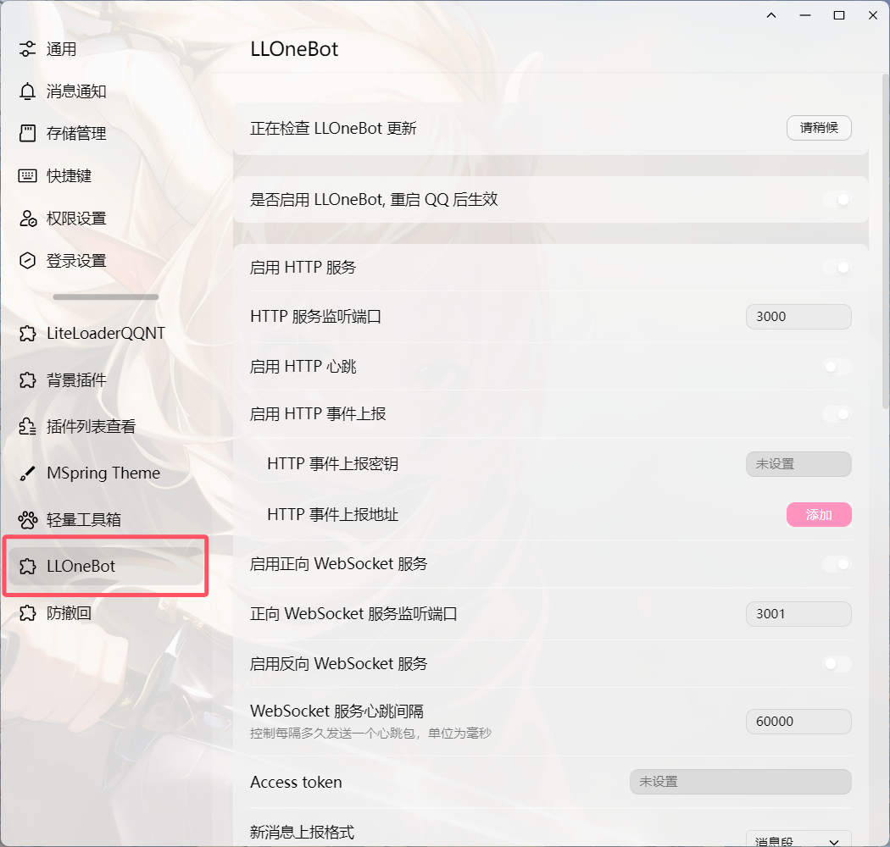

::: danger
本站该教程已经过作者允许上传

另外请勿将与本教程任何相关内容上传至流量平台如：B站
:::

## ①安装LLOneBot

- [脚本安装LLOneBot](./LLOneBot.md)
  - 便捷快速～
    
- [手动安装LLOneBot](./LLOneBot2.md)
  - 脚本安装失败可以尝试手动安装




## ②启用反向 启用 WebSocket 服务

1. 在设置中打开 LLOneBot 找到 启用 WebSocket 服务 并开启


2. 点击下方的 添加 并在输入框中粘贴如下内容 

```
ws://127.0.0.1:8080/onebot/v11/ws/
```


3. 点击右上角的 X 后点击弹窗确定保存后重新启动NTQQ

至此你的 LLOneBot真寻已经部署完成